# Hand\-On Model Physical System in various fidelity level 
<!-- Begin Toc -->

## Table of Contents
[](#TMP_4599)
 
[Hand\-On Model Physical System in various fidelity level](#TMP_7546)
 
&emsp;[Introduction to Simulink](#TMP_12cc)
 
&emsp;&emsp;[Simulink](#TMP_218d)
 
&emsp;&emsp;[Task 0\-1: Simulink block and Simulation](#TMP_5fdc)
 
&emsp;&emsp;[Task 0\-2: Math calculation](#TMP_94d7)
 
&emsp;&emsp;[Task 0\-3: Dashboard control](#TMP_0999)
 
&emsp;[Model Physical System in various fidelity level](#TMP_99a5)
 
&emsp;&emsp;[Task 1: Create fundamental Buck converter circuit](#TMP_0dc5)
 
&emsp;&emsp;[Task 2: Create built\-in Buck converter circuit from Simscape Electrical](#TMP_2404)
 
&emsp;&emsp;[Task 3: Achieve higher fidelity model by configuration parameter](#TMP_73b0)
 
&emsp;&emsp;[Task 4: Voltage control with PID controller](#TMP_0db9)
 
&emsp;&emsp;[Task 5: Tunning Controller with PID tunner](#TMP_5295)
 
&emsp;[\*Optional\* Across the Domain (Rotational + Multibody)](#TMP_6ade)
 
&emsp;&emsp;[Task 6: Connect to another domain (Rotational)](#TMP_6fc0)
 
&emsp;&emsp;[Task 7: Connect to another domain (Multibody)](#TMP_1404)
 
<!-- End Toc -->
<a id="TMP_12cc"></a>

# Introduction to Simulink
<a id="TMP_218d"></a>

## Simulink


<a id="TMP_5fdc"></a>

## Task 0\-1: Simulink block and Simulation
-  Drag and Drop "**Sine Wave**" block from "**Simulink>Sources**" to the workspace 
-  Drag and Drop "**Scope**" block from "**Simulink>Sink**" to the workspace 
-  Connect the signal from "**Sine Wave**" to "**Scope**"  

&nbsp;&nbsp;&nbsp;&nbsp;&nbsp;&nbsp;&nbsp;&nbsp; 

-  Start simulate the system by clicking "**Run**" at Simulate section 

&nbsp;&nbsp;&nbsp;&nbsp;&nbsp;&nbsp;&nbsp;&nbsp; 

-  Check the output by double click at "**Scope**" 

&nbsp;&nbsp;&nbsp;&nbsp;&nbsp;&nbsp;&nbsp;&nbsp; 

<a id="TMP_94d7"></a>

## Task 0\-2: Math calculation
-  Drag and Drop "**Gain**" block from "**Simulink>Math Operations**" to the workspace 
-  Place the "**Gain**" block in the signal line between "**Sine Wave**" and "**Scope**" block  

&nbsp;&nbsp;&nbsp;&nbsp;&nbsp;&nbsp;&nbsp;&nbsp; 

-  Double click at "Gain" block and Change the gain value to 2 

&nbsp;&nbsp;&nbsp;&nbsp;&nbsp;&nbsp;&nbsp;&nbsp; 

-  Start simulate the system by clicking "**Run**" at Simulate section 
-  Check the output by double click at "**Scope**" 

&nbsp;&nbsp;&nbsp;&nbsp;&nbsp;&nbsp;&nbsp;&nbsp; 

<a id="TMP_0999"></a>

## Task 0\-3: Dashboard control
-  Drag and Drop "**Slider**" block from "**Simulink>Dashboard**" to the workspace 

&nbsp;&nbsp;&nbsp;&nbsp;&nbsp;&nbsp;&nbsp;&nbsp;  

-  Double click at "**Slider**" \-\-> Select "**Gain**" block \-\-> Click at "**Connect**" check of the gain value \-\-> Click "**OK**" to confirm 

&nbsp;&nbsp;&nbsp;&nbsp;&nbsp;&nbsp;&nbsp;&nbsp; 

-  Change "**Stop Time**" to "**Inf**" 

&nbsp;&nbsp;&nbsp;&nbsp;&nbsp;&nbsp;&nbsp;&nbsp; 

-  Try to Slide the "**Slider**" bar and see the changed of Sine Wave at "**Scope**" 

&nbsp;&nbsp;&nbsp;&nbsp;&nbsp;&nbsp;&nbsp;&nbsp; 

<a id="TMP_99a5"></a>

# Model Physical System in various fidelity level
<a id="TMP_1f13"></a>
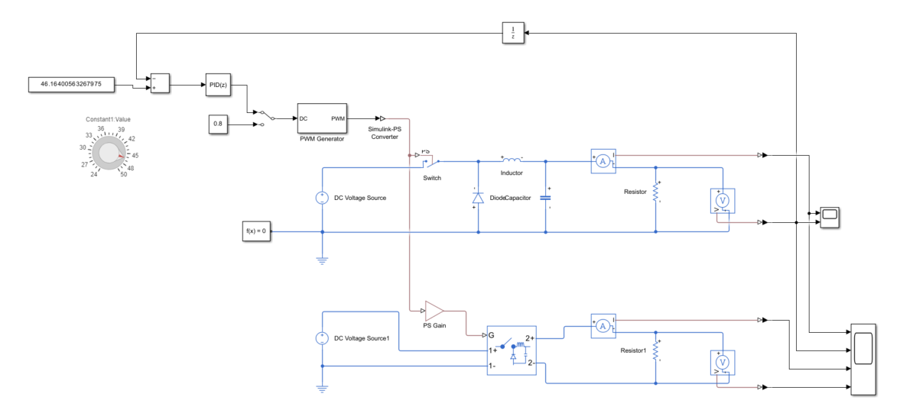
<a id="TMP_0dc5"></a>

## Task 1: Create fundamental Buck converter circuit
1.  Drag the block from

&nbsp;&nbsp;&nbsp;&nbsp;&nbsp;&nbsp;&nbsp;&nbsp;&nbsp;&nbsp;&nbsp;&nbsp; **Simscape>Foundation Library>Electrical Sources**


&nbsp;&nbsp;&nbsp;&nbsp;&nbsp;&nbsp;&nbsp;&nbsp;&nbsp;&nbsp;&nbsp;&nbsp; 


&nbsp;&nbsp;&nbsp;&nbsp;&nbsp;&nbsp;&nbsp;&nbsp;&nbsp;&nbsp;&nbsp;&nbsp; **Simscape>Foundation Library>Electrical Element**

<a id="TMP_206b"></a>

&nbsp;&nbsp;&nbsp;&nbsp;&nbsp;&nbsp;&nbsp;&nbsp;&nbsp;&nbsp;&nbsp;&nbsp; 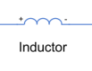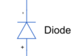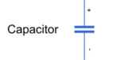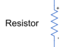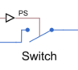


&nbsp;&nbsp;&nbsp;&nbsp;&nbsp;&nbsp;&nbsp;&nbsp;&nbsp;&nbsp;&nbsp;&nbsp; 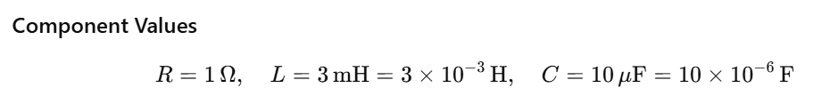


&nbsp;&nbsp;&nbsp;&nbsp;&nbsp;&nbsp;&nbsp;&nbsp;&nbsp;&nbsp;&nbsp;&nbsp; **Simscape>Foundation Library>Electrical Sensor**


&nbsp;&nbsp;&nbsp;&nbsp;&nbsp;&nbsp;&nbsp;&nbsp;&nbsp;&nbsp;&nbsp;&nbsp; 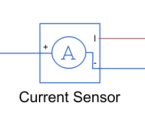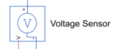


&nbsp;&nbsp;&nbsp;&nbsp;&nbsp;&nbsp;&nbsp;&nbsp;&nbsp;&nbsp;&nbsp;&nbsp; **Simscape>Utilities**


 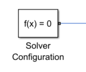


&nbsp;&nbsp;&nbsp;&nbsp;&nbsp;&nbsp;&nbsp;&nbsp; 2. Connect Buck converter circuit


&nbsp;&nbsp;&nbsp;&nbsp;&nbsp;&nbsp;&nbsp;&nbsp; 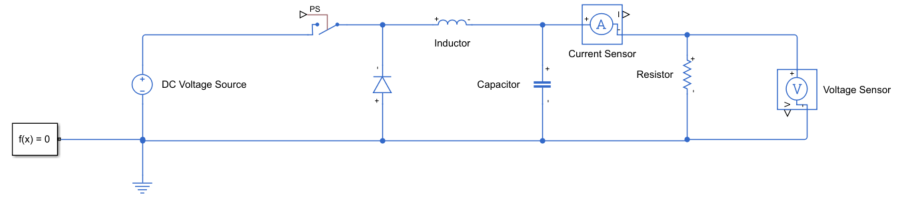


&nbsp;&nbsp;&nbsp;&nbsp;&nbsp;&nbsp;&nbsp;&nbsp; 3. Adding "PWM" to input "Switch" Block, Set up constant at 0.8 for duty cycle, Set Period to 1e\-5, Sample time at 1e\-6


&nbsp;&nbsp;&nbsp;&nbsp;&nbsp;&nbsp;&nbsp;&nbsp; 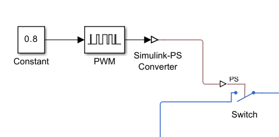


&nbsp;&nbsp;&nbsp;&nbsp;&nbsp;&nbsp;&nbsp;&nbsp; 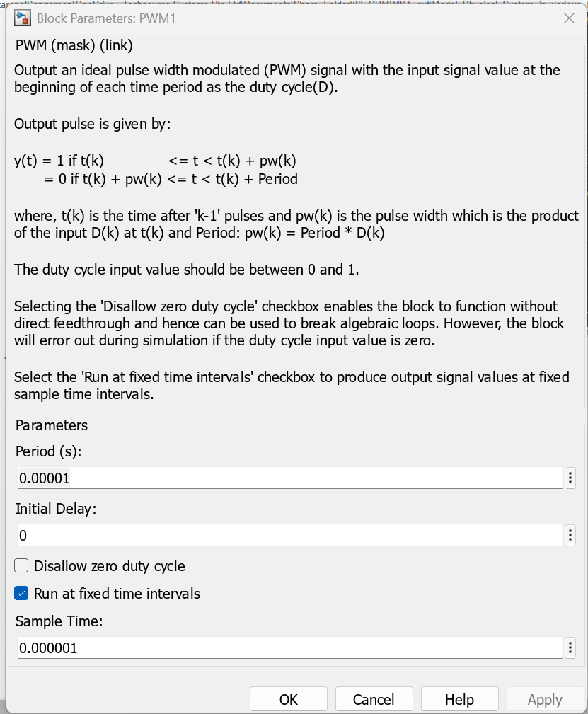


&nbsp;&nbsp;&nbsp;&nbsp;&nbsp;&nbsp;&nbsp;&nbsp; 4. Adding "Scope" Block to see the output


&nbsp;&nbsp;&nbsp;&nbsp;&nbsp;&nbsp;&nbsp;&nbsp;&nbsp;&nbsp;&nbsp;&nbsp; 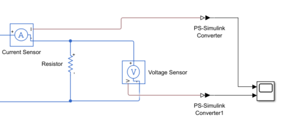


&nbsp;&nbsp;&nbsp;&nbsp;&nbsp;&nbsp;&nbsp;&nbsp; 5. Change simulation stop time to 5 second and click "Run" to start the simulation \-\-> Check the result at "Scope" block


&nbsp;&nbsp;&nbsp;&nbsp;&nbsp;&nbsp;&nbsp;&nbsp; \*You may zoom in to scope down the time at 0 \- 0.005 to see the transient response


&nbsp;&nbsp;&nbsp;&nbsp;&nbsp;&nbsp;&nbsp;&nbsp; 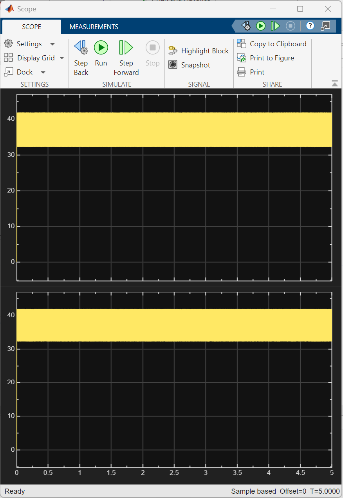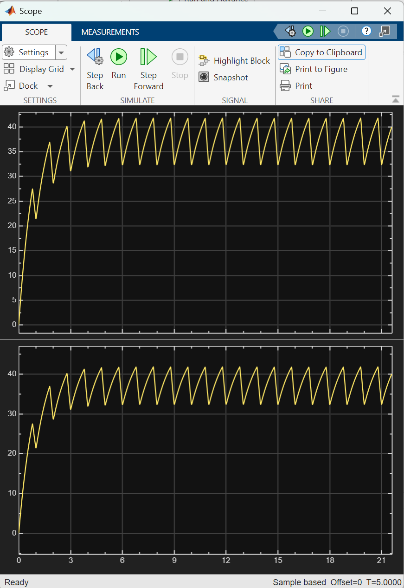

<a id="TMP_2404"></a>

## Task 2: Create built\-in Buck converter circuit from Simscape Electrical

&nbsp;&nbsp;&nbsp;&nbsp;&nbsp;&nbsp;&nbsp;&nbsp; 1. Drag the block from


&nbsp;&nbsp;&nbsp;&nbsp;&nbsp;&nbsp;&nbsp;&nbsp; **Simscape>Electrical>Semiconductors & Converters>Buck Converter**


&nbsp;&nbsp;&nbsp;&nbsp;&nbsp;&nbsp;&nbsp;&nbsp; 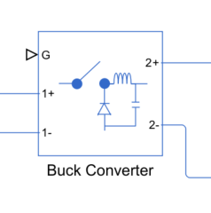


&nbsp;&nbsp;&nbsp;&nbsp;&nbsp;&nbsp;&nbsp;&nbsp; 2.  Replace the "Buck Converter" block to the previous circuit


&nbsp;&nbsp;&nbsp;&nbsp;&nbsp;&nbsp;&nbsp;&nbsp; 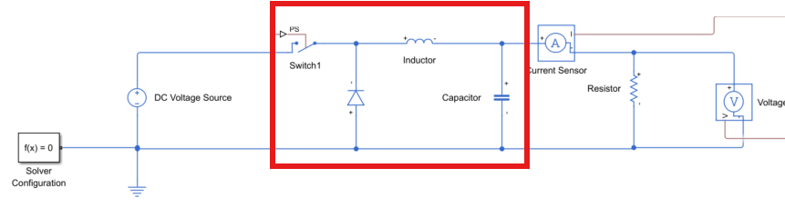


&nbsp;&nbsp;&nbsp;&nbsp;&nbsp;&nbsp;&nbsp;&nbsp; 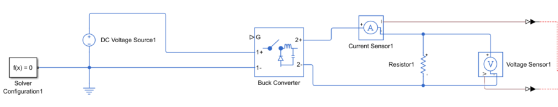


&nbsp;&nbsp;&nbsp;&nbsp;&nbsp;&nbsp;&nbsp;&nbsp; 3. Set the parameter as setting in the previous model


&nbsp;&nbsp;&nbsp;&nbsp;&nbsp;&nbsp;&nbsp;&nbsp; 


&nbsp;&nbsp;&nbsp;&nbsp;&nbsp;&nbsp;&nbsp;&nbsp; 4. Change simulation stop time to 5 second and click "Run" to start the simulation \-\-> Check the result at "Scope" block


&nbsp;&nbsp;&nbsp;&nbsp;&nbsp;&nbsp;&nbsp;&nbsp; \*You may compare the different between 2 approch model by merge the signal to the same scope


&nbsp;&nbsp;&nbsp;&nbsp;&nbsp;&nbsp;&nbsp;&nbsp; 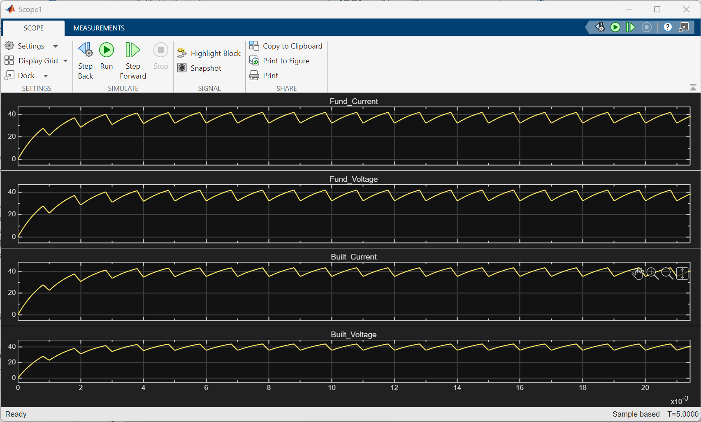


&nbsp;&nbsp;&nbsp;&nbsp;&nbsp;&nbsp;&nbsp;&nbsp; 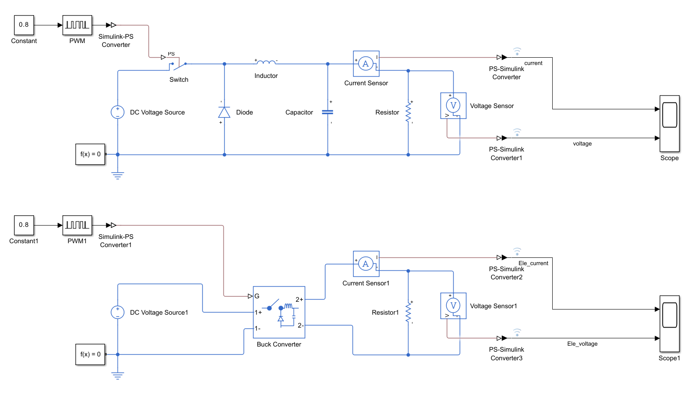

```matlab
open("Buck_Converter_2_approch.slx")
```
<a id="TMP_73b0"></a>

## Task 3: Achieve higher fidelity model by configuration parameter
1.  Checking "Buck Converter" Block parameter \-\-> Checking "Switching device" \-\-> Change to "Ideal Semiconductor Switch"

&nbsp;&nbsp;&nbsp;&nbsp;&nbsp;&nbsp;&nbsp;&nbsp; 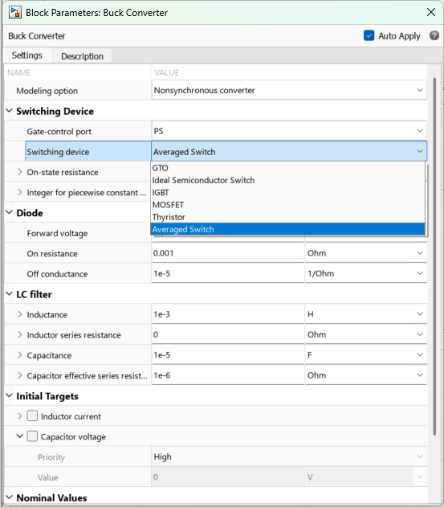


&nbsp;&nbsp;&nbsp;&nbsp;&nbsp;&nbsp;&nbsp;&nbsp; 2. Change simulation stop time to 5 second and click "Run" to start the simulation \-\-> Check the result at "Scope" block compare to the fundamental circuit


&nbsp;&nbsp;&nbsp;&nbsp;&nbsp;&nbsp;&nbsp;&nbsp; 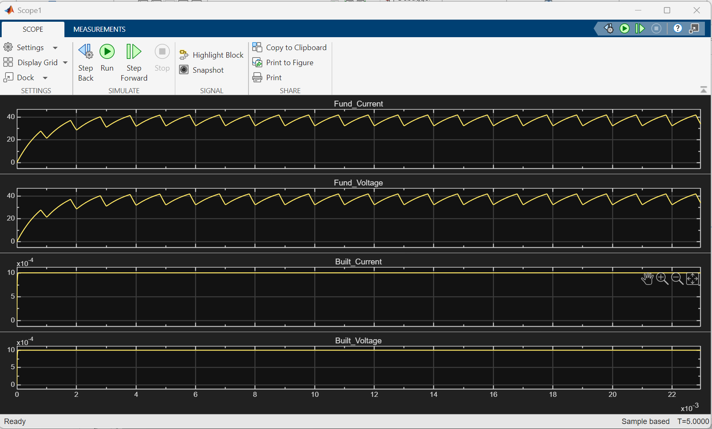


&nbsp;&nbsp;&nbsp;&nbsp;&nbsp;&nbsp;&nbsp;&nbsp; 3. Add "PS Gain" from  **Simscape>Foundation Library>Physical Signals** between PWM signal to Gate of "Buck Converter" \-\-> Set the gain at 12


&nbsp;&nbsp;&nbsp;&nbsp;&nbsp;&nbsp;&nbsp;&nbsp; \*PWM voltage signal need to be more than threshold to drive the gate open (More fidelity)


&nbsp;&nbsp;&nbsp;&nbsp;&nbsp;&nbsp;&nbsp;&nbsp;&nbsp;&nbsp;&nbsp;&nbsp;&nbsp;&nbsp;&nbsp;&nbsp; 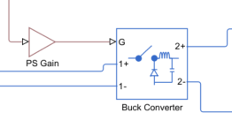


&nbsp;&nbsp;&nbsp;&nbsp;&nbsp;&nbsp;&nbsp;&nbsp; 4. Simulation again and checking the scope


&nbsp;&nbsp;&nbsp;&nbsp;&nbsp;&nbsp;&nbsp;&nbsp; 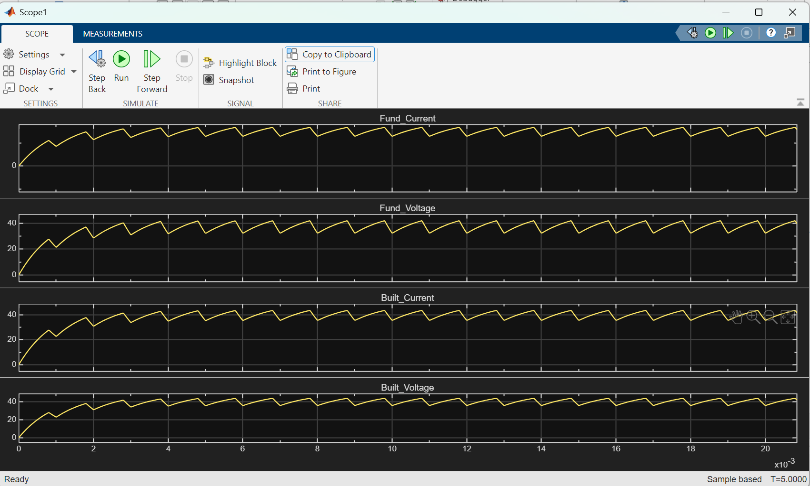

<a id="TMP_0db9"></a>

## Task 4: Voltage control with PID controller
1.  Adding "Unit Delay" block to feedback the Output volage of Buck converter
2. Adding "Subtract" block \-\-> Subtract "Feedback voltage" with constant (Set as 40 for the default setpoint) to get the error value
3. Adding "PID controller" to make the PID control \-\-> Sending the PWM control to PWM Generator

&nbsp;&nbsp;&nbsp;&nbsp;&nbsp;&nbsp;&nbsp;&nbsp; 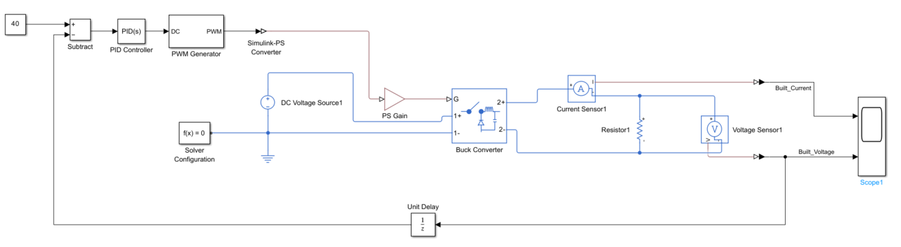


&nbsp;&nbsp;&nbsp;&nbsp;&nbsp;&nbsp;&nbsp;&nbsp; 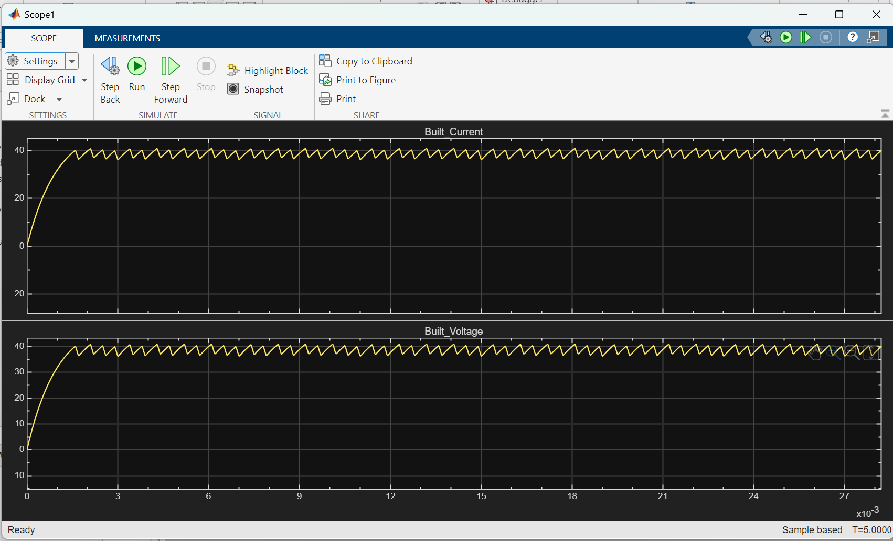


&nbsp;&nbsp;&nbsp;&nbsp;&nbsp;&nbsp;&nbsp;&nbsp; \*You may try to change the value of PID gain by double click at "PID controller" 


&nbsp;&nbsp;&nbsp;&nbsp;&nbsp;&nbsp;&nbsp;&nbsp; 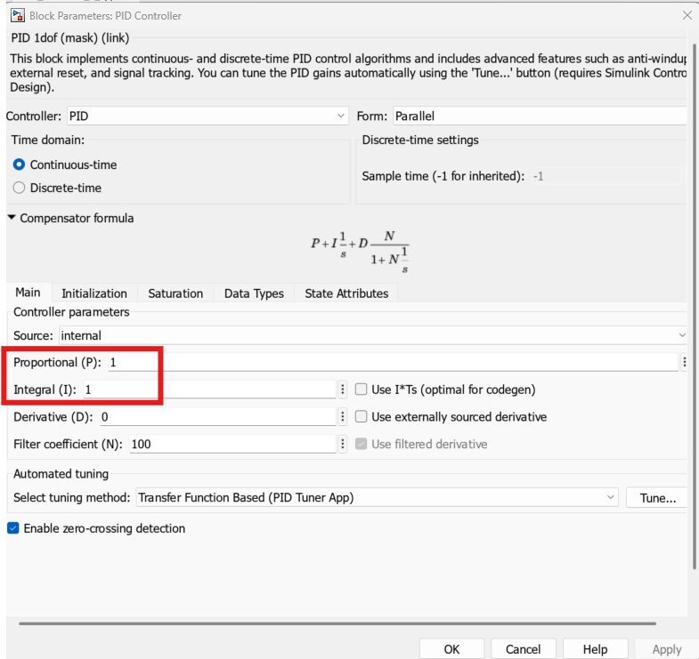

<a id="TMP_5295"></a>

## Task 5: Tunning Controller with PID tunner
-  Double click at "**Discrete PID Controller**" \-\-> Click "**Tune**" button 

&nbsp;&nbsp;&nbsp;&nbsp;&nbsp;&nbsp;&nbsp;&nbsp; 

-  PID tuner window will pop\-up. You can try to tune your controller's "**Response time**" and "**Transient Behavior**" by sliding the bar in picture below \-\-> Click "**Update Block**" after you finished 

&nbsp;&nbsp;&nbsp;&nbsp;&nbsp;&nbsp;&nbsp;&nbsp; \*In this case you may face that "Plant cannot be linearized. Use the Plant menu to create or select a new plant." \-\-> Because the system canot be linearized \-\-> Linearize manually     by sellecting the operating point.


&nbsp;&nbsp;&nbsp;&nbsp;&nbsp;&nbsp;&nbsp;&nbsp; 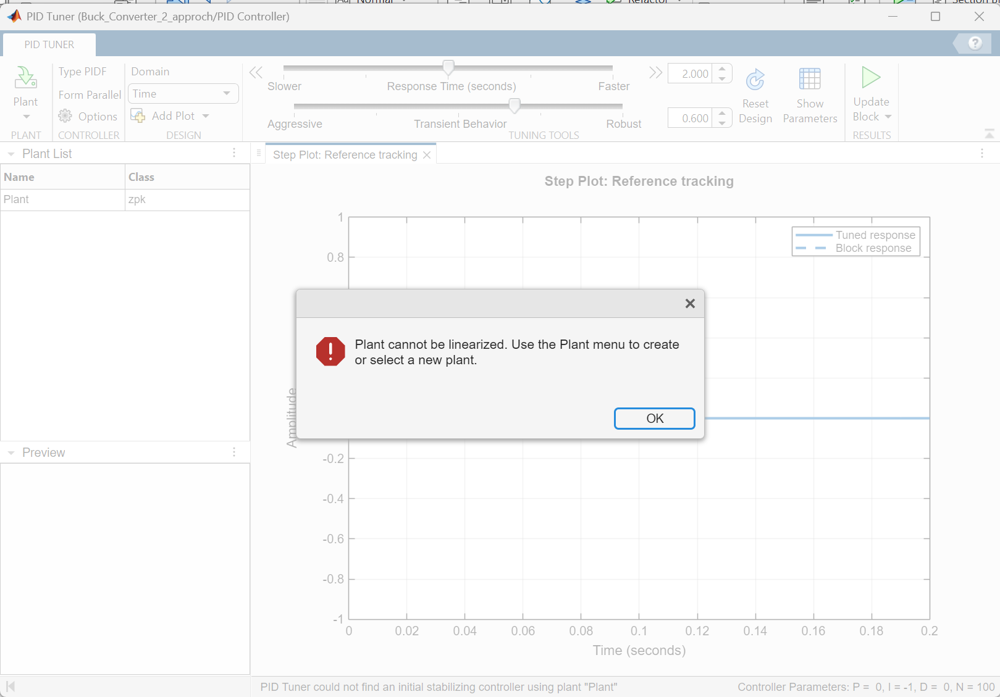


&nbsp;&nbsp;&nbsp;&nbsp;&nbsp;&nbsp;&nbsp;&nbsp; Goto "Identify New Plant"


&nbsp;&nbsp;&nbsp;&nbsp;&nbsp;&nbsp;&nbsp;&nbsp; 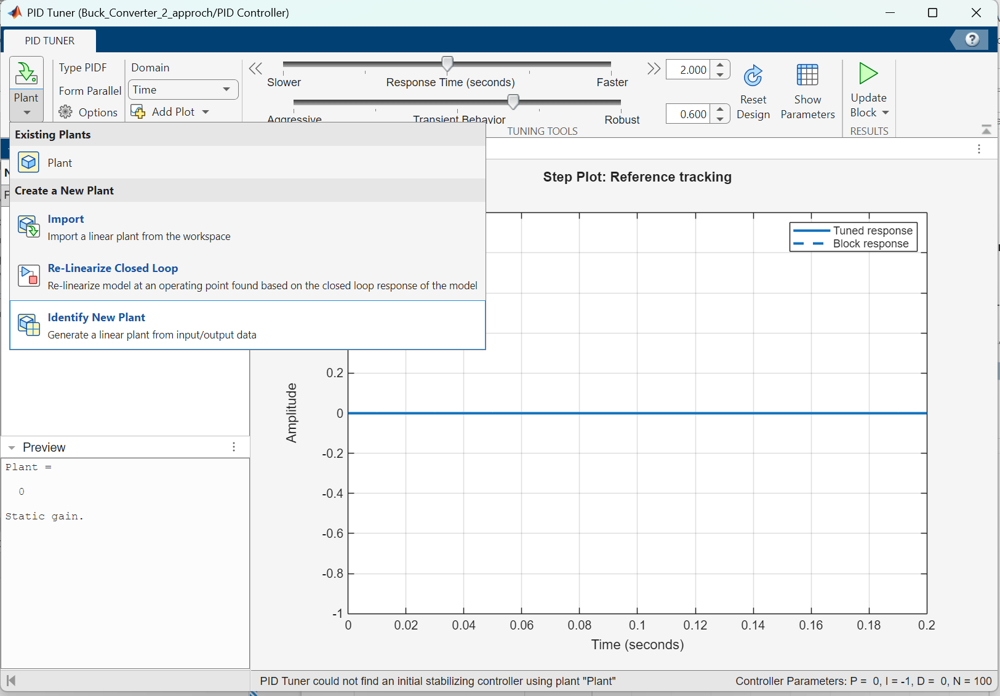


&nbsp;&nbsp;&nbsp;&nbsp;&nbsp;&nbsp;&nbsp;&nbsp; Go to "PLANT IDENTIFICATION" \-\-> "Get I/O Data" \-\-> Simulate Data


&nbsp;&nbsp;&nbsp;&nbsp;&nbsp;&nbsp;&nbsp;&nbsp; 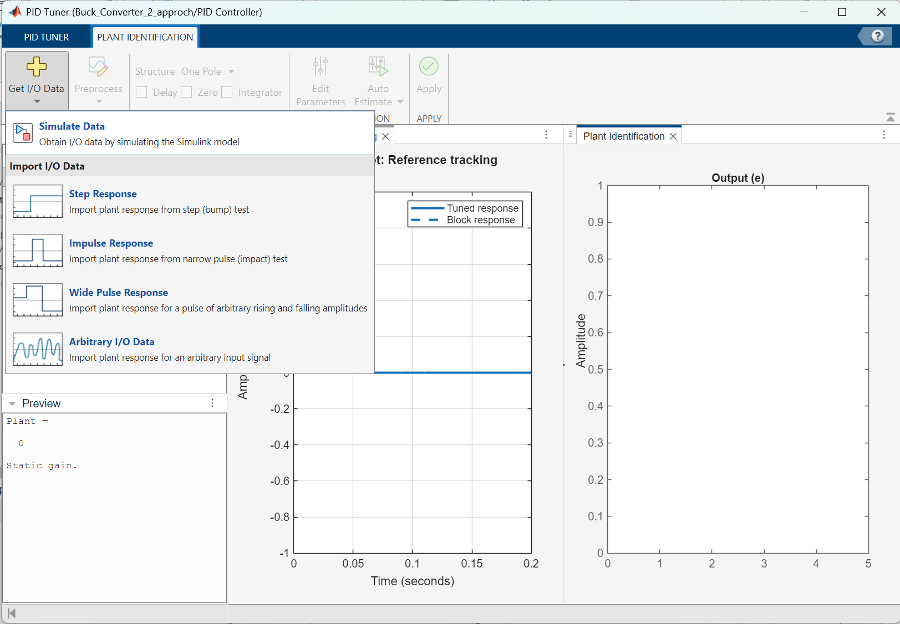


&nbsp;&nbsp;&nbsp;&nbsp;&nbsp;&nbsp;&nbsp;&nbsp; Identify the model and click "Accept" it


&nbsp;&nbsp;&nbsp;&nbsp;&nbsp;&nbsp;&nbsp;&nbsp; 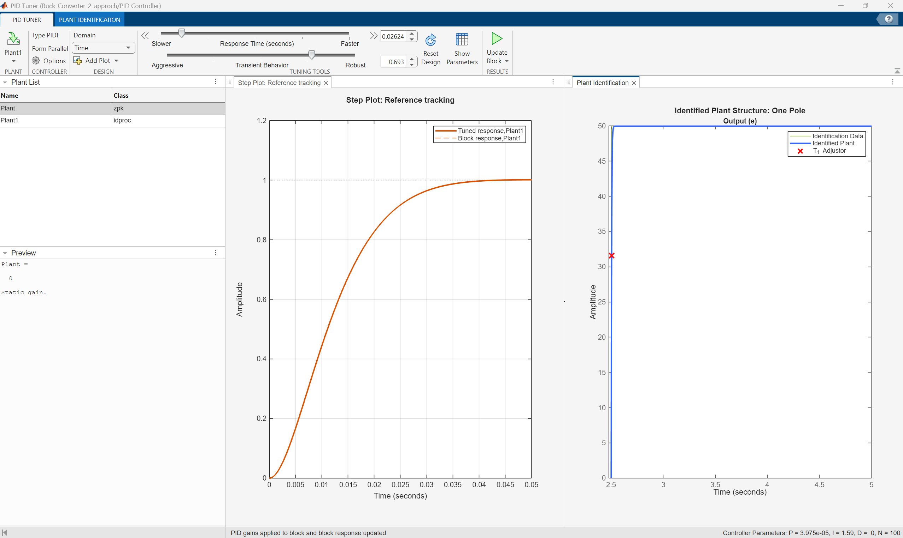


&nbsp;&nbsp;&nbsp;&nbsp;&nbsp;&nbsp;&nbsp; You can try to tune the response by using sliding bar.


&nbsp;&nbsp;&nbsp;&nbsp;&nbsp;&nbsp;&nbsp;&nbsp; 


&nbsp;&nbsp;&nbsp;&nbsp;&nbsp;&nbsp;&nbsp;&nbsp; Try to "**Run**" simulation again to see the chage after you tunning


&nbsp;&nbsp;&nbsp;&nbsp;&nbsp;&nbsp;&nbsp;&nbsp; 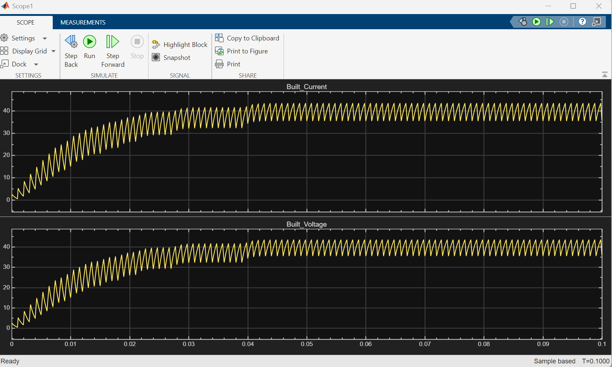


```matlab
open("Buck_Converter_2_PID_Tune.slx")
```
<a id="TMP_6ade"></a>

# \*Optional\* Across the Domain (Rotational + Multibody)
<a id="TMP_7f45"></a>
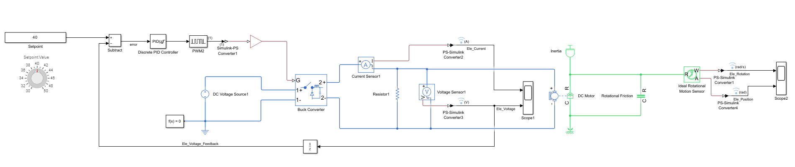
<a id="TMP_6fc0"></a>

## Task 6: Connect to another domain (Rotational)
1.  Drag the block from

&nbsp;&nbsp;&nbsp;&nbsp;&nbsp;&nbsp;&nbsp;&nbsp;&nbsp;&nbsp;&nbsp;&nbsp; **Simscape>Electrical>Electromechanical>Brushed Motors**


&nbsp;&nbsp;&nbsp;&nbsp;&nbsp;&nbsp;&nbsp;&nbsp;&nbsp;&nbsp;&nbsp;&nbsp; 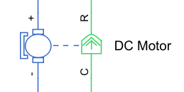


&nbsp;&nbsp;&nbsp;&nbsp;&nbsp;&nbsp;&nbsp;&nbsp; 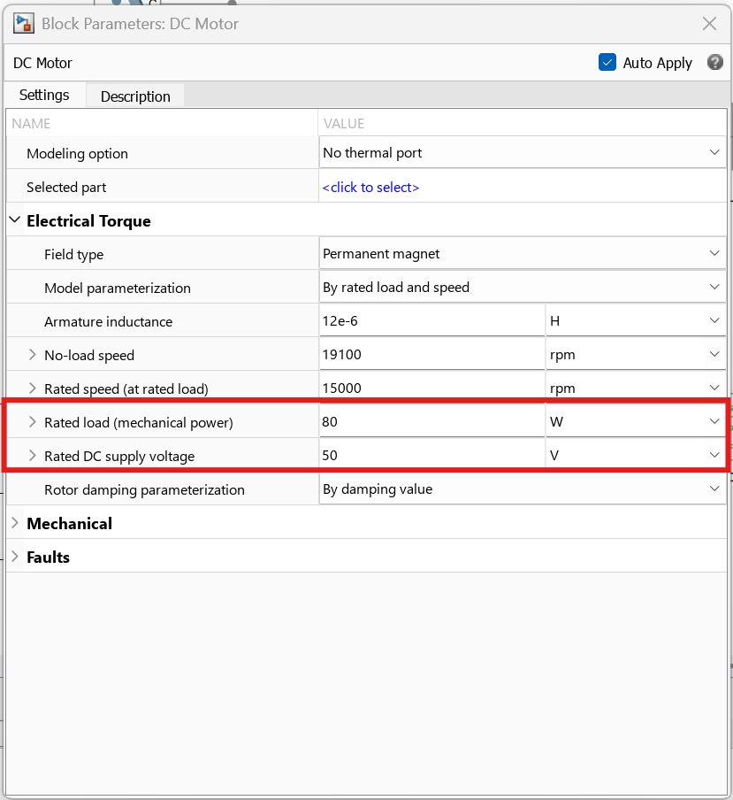


&nbsp;&nbsp;&nbsp;&nbsp;&nbsp;&nbsp;&nbsp;&nbsp;&nbsp;&nbsp;&nbsp;&nbsp; **Simscape>Foundation Library>Mechanical>Rotational Elements**

<a id="TMP_206b"></a>

&nbsp;&nbsp;&nbsp;&nbsp;&nbsp;&nbsp;&nbsp;&nbsp;&nbsp;&nbsp;&nbsp;&nbsp; 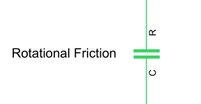


&nbsp;&nbsp;&nbsp;&nbsp;&nbsp;&nbsp;&nbsp;&nbsp;&nbsp;&nbsp;&nbsp;&nbsp; 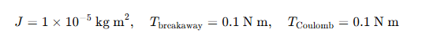


&nbsp;&nbsp;&nbsp;&nbsp;&nbsp;&nbsp;&nbsp;&nbsp;&nbsp;&nbsp;&nbsp;&nbsp; **Simscape>Foundation Library>Electrical Sensor**


&nbsp;&nbsp;&nbsp;&nbsp;&nbsp;&nbsp;&nbsp;&nbsp;&nbsp;&nbsp;&nbsp;&nbsp; 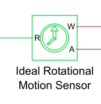


&nbsp;&nbsp;&nbsp;&nbsp;&nbsp;&nbsp;&nbsp;&nbsp; 


&nbsp;&nbsp;&nbsp;&nbsp;&nbsp;&nbsp;&nbsp;&nbsp; 2. Connect "DC Motor" cascading to the "Buck converter" + Connect the scope to the sensor


&nbsp;&nbsp;&nbsp;&nbsp;&nbsp;&nbsp;&nbsp;&nbsp; 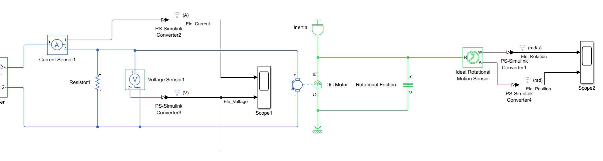


&nbsp;&nbsp;&nbsp;&nbsp;&nbsp;&nbsp;&nbsp;&nbsp; 3.  Simulate at 1 seconds


&nbsp;&nbsp;&nbsp;&nbsp;&nbsp;&nbsp;&nbsp;&nbsp; 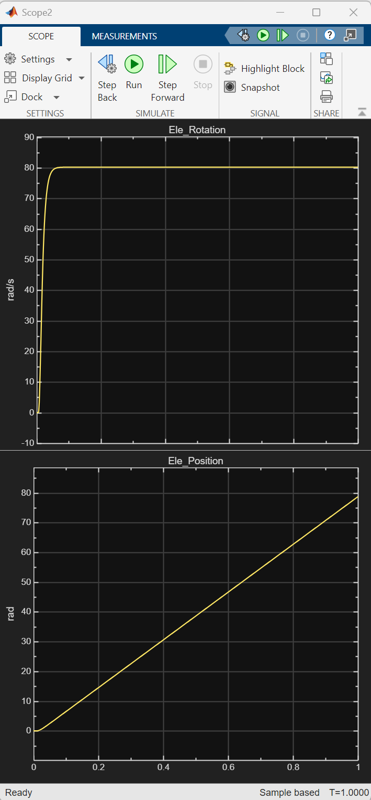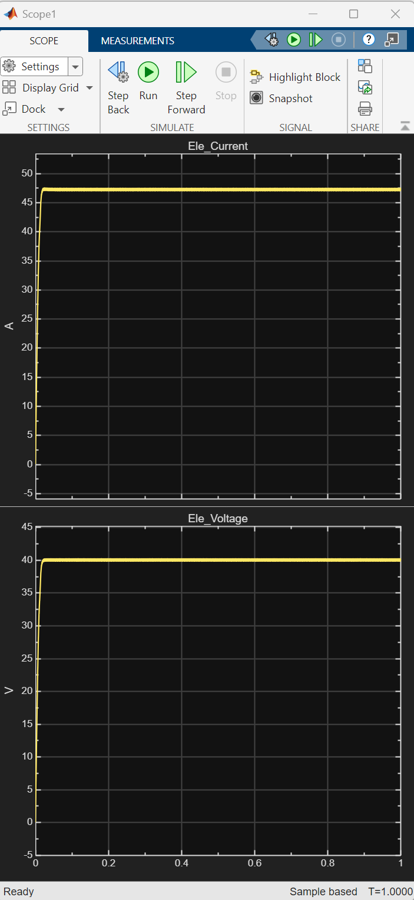

<a id="TMP_1404"></a>

## Task 7: Connect to another domain (Multibody)

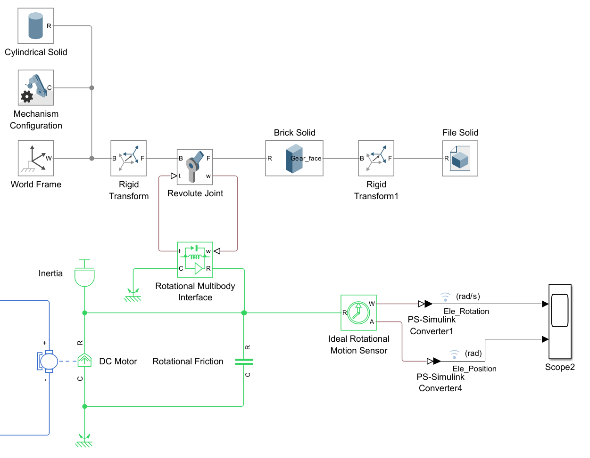


        

1.   **\[Create Reference\]** Drag the block from

&nbsp;&nbsp;&nbsp;&nbsp;&nbsp;&nbsp;&nbsp;&nbsp;&nbsp;&nbsp;&nbsp;&nbsp; **Simscape>Multibody>Frame and Transforms**


&nbsp;&nbsp;&nbsp;&nbsp;&nbsp;&nbsp;&nbsp;&nbsp;&nbsp;&nbsp;&nbsp;&nbsp; 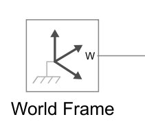


&nbsp;&nbsp;&nbsp;&nbsp;&nbsp;&nbsp;&nbsp;&nbsp;&nbsp;&nbsp;&nbsp;&nbsp; **Simscape>Multibody>Utilities**

<a id="TMP_206b"></a>

&nbsp;&nbsp;&nbsp;&nbsp;&nbsp;&nbsp;&nbsp;&nbsp;&nbsp;&nbsp;&nbsp;&nbsp; 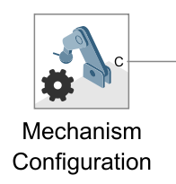


&nbsp;&nbsp;&nbsp;&nbsp;&nbsp;&nbsp;&nbsp;&nbsp;&nbsp;&nbsp;&nbsp;&nbsp; **Simscape>Multibody>Body Elements**


 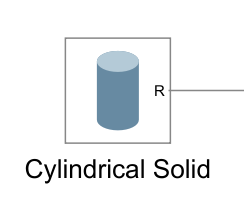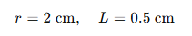


&nbsp;&nbsp;&nbsp;&nbsp;&nbsp;&nbsp;&nbsp;&nbsp;&nbsp;&nbsp;&nbsp;&nbsp; 2.  **\[Create Joint\]** Drag the block


&nbsp;&nbsp;&nbsp;&nbsp;&nbsp;&nbsp;&nbsp;&nbsp;&nbsp;&nbsp;&nbsp;&nbsp; **Simscape>Multibody>Frame and Transforms**


 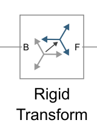


&nbsp;&nbsp;&nbsp;&nbsp;&nbsp;&nbsp;&nbsp;&nbsp;&nbsp;&nbsp;&nbsp;&nbsp; 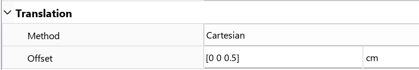


&nbsp;&nbsp;&nbsp;&nbsp;&nbsp;&nbsp;&nbsp;&nbsp;&nbsp;&nbsp;&nbsp;&nbsp; **Simscape>Multibody>Joints**


 


&nbsp;&nbsp;&nbsp;&nbsp;&nbsp;&nbsp;&nbsp;&nbsp;&nbsp;&nbsp;&nbsp;&nbsp; 


&nbsp;&nbsp;&nbsp;&nbsp;&nbsp;&nbsp;&nbsp;&nbsp;&nbsp;&nbsp;&nbsp;&nbsp; **Simscape>Multibody>Body Elements**


 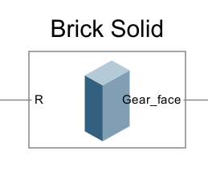


&nbsp;&nbsp;&nbsp;&nbsp;&nbsp;&nbsp;&nbsp;&nbsp;&nbsp;&nbsp;&nbsp;&nbsp; 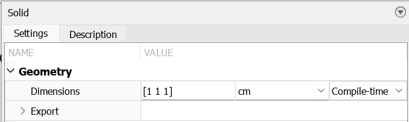 


&nbsp;&nbsp;&nbsp;&nbsp;&nbsp;&nbsp;&nbsp;&nbsp;&nbsp;&nbsp;&nbsp;&nbsp; **Simscape>Simscape Mechanical Interfaces**


 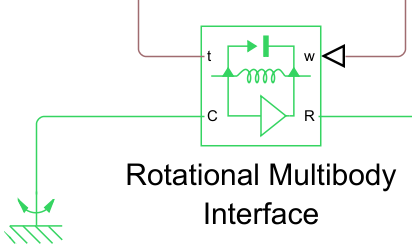


&nbsp;&nbsp;&nbsp;&nbsp;&nbsp;&nbsp;&nbsp;&nbsp;&nbsp;&nbsp;&nbsp;&nbsp; 3. Connect model together


&nbsp;&nbsp;&nbsp;&nbsp;&nbsp;&nbsp;&nbsp;&nbsp;&nbsp;&nbsp;&nbsp;&nbsp; 


&nbsp;&nbsp;&nbsp;&nbsp;&nbsp;&nbsp;&nbsp;&nbsp;&nbsp;&nbsp;&nbsp;&nbsp; 4. Simulate at 1 seconds


&nbsp;&nbsp;&nbsp;&nbsp;&nbsp;&nbsp;&nbsp;&nbsp;&nbsp;&nbsp;&nbsp; 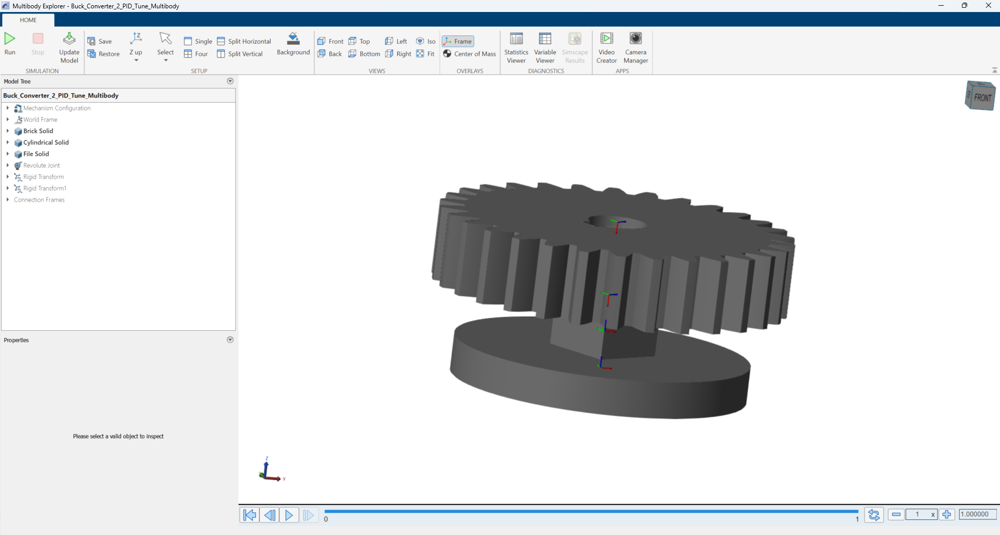


            

